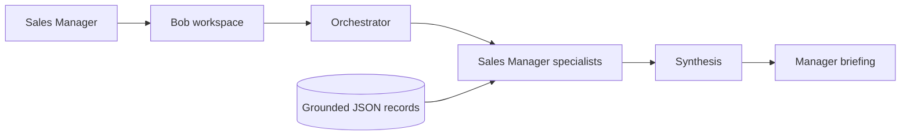

# Bob — Sales Manager briefing

## Audience and outcome

- Built for Sales Managers who need one place to inspect the current forecast,
  coach reps, assess future pipeline, and answer sales-policy questions.
- One orchestrator routes each request to grounded specialists.
- One synthesis step returns Summary, Insights, Actions, and Artifacts.
- Facts come from linked JSON fixtures until live CRM and enablement connectors
  are introduced.

## Specialist teams

- Forecasting: deal/forecast risks and Sales Stage Validator.
- Forecast inspection: verbal call, roll-up, coverage, backup, CRM score,
  pacing, and weekly updates.
- Rep participation: help signals, coaching, oversight, and productivity.
- Future-quarter pipeline: stagnation, Q+1/Q+2 modeling, and risks/gaps.
- FAQ agents: Rules of Engagement, Pricing & Quoting, Commission Plans, and
  Product Overview.

## Data flow

## Technology

- Python, Google ADK, Gemini, FastAPI, Uvicorn, and Pydantic.
- HTML/CSS/JavaScript workspace with server-sent streaming.
- Consolidated Salesforce, Gong, Workday, activity, and Confluence snapshots in `new_dummy_data/*.json`.
- Routing evals and pytest coverage for every menu workflow.
- Run with `python -m ui`, then open http://127.0.0.1:8080.
